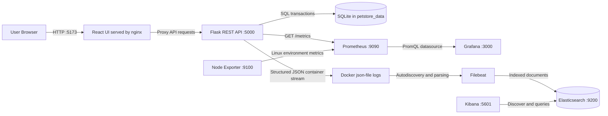

# Paws & Cart / Online Pet Store

A small online pet store project built with a Flask API, SQLite persistence, and a React + Vite frontend, instrumented end-to-end with Prometheus, Grafana, and the Elastic Stack (Filebeat, Elasticsearch, Kibana).

## Part A: Problem, users, and solution

Small pet shops need a simple way to present products, track stock, accept orders, and complete them without the complexity of a full e-commerce platform. Paws & Cart is intended for a shop operator demonstrating these everyday workflows and for students learning how application behavior becomes observable.

The React interface displays the catalogue and current orders. The Flask REST API validates purchases and completion requests, while SQLite persists products, stock, and orders. The surrounding monitoring and logging stack makes request performance, business activity, infrastructure usage, and application events inspectable.

Current application features are:

- browse six pet products and current stock;
- create quantity-based orders with stock validation;
- view pending and completed orders;
- complete pending orders;
- preserve application state in SQLite;
- check backend health at `GET /health`.

## Current architecture

- Frontend: React + Vite application served through nginx in a production container
- Backend: Flask REST API running in a dedicated Docker container
- Database: SQLite persisted in a Docker named volume at /app/data
- Metrics: Prometheus and Grafana running in Docker
- Infrastructure metrics: Node Exporter for the host machine running Docker
- Application metrics: Prometheus client metrics exposed at /metrics for the Flask backend
- Logs: Filebeat -> Elasticsearch -> Kibana, reading the backend's structured JSON logs from Docker
- Runtime: Docker Desktop on Windows (project files live on the Windows filesystem, not inside WSL)

## Prerequisites

- Docker Desktop for Windows (or Docker Engine + Compose on Linux/Mac)
- Python 3.12 and Node.js 20+ only if you want to run the frontend/backend natively outside Docker; not required for the Docker-based setup below

## Docker setup (recommended path)

Build and start every service:

```bash
docker compose up --build -d
```

View running services:

```bash
docker compose ps
```

Rebuild and restart just the backend after a code change:

```bash
docker compose up -d --build backend
```

If you only changed an environment variable or resource limit (not code), a full recreate is more reliable than a plain restart:

```bash
docker compose up -d --force-recreate <service-name>
```

Stop the project (keeps all named volumes/data):

```bash
docker compose stop
```

Do not run `docker compose down -v`, `docker volume prune`, or `docker system prune` for routine shutdown — these delete stored metrics/log history.

### Normal stop versus full reset

A normal stop preserves SQLite, Prometheus, Grafana, and Elasticsearch data:

```bash
docker compose stop
```

Start the existing containers and retained data again with:

```bash
docker compose start
```

**Destructive full reset:** the following command removes the project containers and named volumes. It permanently deletes application data and stored observability history. Use it only when a completely fresh demonstration environment is intentionally required and after preserving any evidence you need:

```bash
docker compose down -v
```

Never use Docker-wide prune commands for project cleanup because they can affect unrelated applications.

## Service ports

- Frontend: http://localhost:5173
- Backend: http://localhost:5000
- Prometheus: http://localhost:9090
- Grafana: http://localhost:3000 (login: admin / admin)
- Kibana: http://localhost:5601
- Elasticsearch: http://localhost:9200
- Node Exporter: http://localhost:9100

## Using the Pet Store

Open http://localhost:5173 to use the React interface. Product cards show price and stock; choose a quantity and select **Buy**. The Orders section shows persisted orders and provides **Complete order** for pending orders.

The same operations are available through the API:

```bash
curl http://localhost:5000/health
curl http://localhost:5000/products
curl http://localhost:5000/orders
curl -X POST -H "Content-Type: application/json" -d '{"product_id":1,"quantity":1}' http://localhost:5000/orders
curl -X POST http://localhost:5000/orders/1/complete
```

The two POST examples change persisted data. Use real order IDs returned by the API, and check stock before creating demonstration orders.

## Persistence

SQLite data, Prometheus's TSDB, Grafana's settings, and Elasticsearch's indices each live in their own named Docker volume, so they all survive normal container restarts and rebuilds.

## Application metrics

The backend exposes Prometheus metrics at http://localhost:5000/metrics.

### Implemented metrics

| Metric | Type | Category | Purpose | Unit | Labels | Code location | When recorded |
| --- | --- | --- | --- | --- | --- | --- | --- |
| petstore_orders_total | Counter | Business metric | Count successfully created orders | requests | none | app.py, metrics.py | After a successful POST /orders commit |
| petstore_pending_orders | Gauge | Business metric | Reflect the current number of pending orders in SQLite | orders | none | metrics.py | Reconstructed from SQLite on startup and after create/complete events |
| petstore_http_request_duration_seconds | Histogram | Application metric | Measure HTTP request latency | seconds | method, route, status_code | app.py, metrics.py | Flask before/after request hooks |
| petstore_order_processing_seconds | Summary | Business timing metric | Measure successful order creation processing time | seconds | none | app.py, metrics.py | After successful POST /orders completes |

### PromQL examples

```promql
histogram_quantile(
  0.95,
  sum by (le) (rate(petstore_http_request_duration_seconds_bucket[5m]))
)
```

```promql
histogram_quantile(
  0.99,
  sum by (le) (rate(petstore_http_request_duration_seconds_bucket[5m]))
)
```

```promql
rate(petstore_order_processing_seconds_sum[5m])
/
rate(petstore_order_processing_seconds_count[5m])
```

### Histogram vs Summary note

The Histogram is used for latency distribution and p95/p99 via `histogram_quantile()`.

The Summary exposes `_sum` and `_count` for average processing time in Python's `prometheus_client` implementation. It does not provide client-side quantile values, so p95/p99 must be calculated from the Histogram instead.

## Grafana dashboards

Grafana dashboards are provisioned as code and loaded automatically from the provisioning folder when the Grafana container starts.

### Included dashboards

- Pet Store application/business dashboard: `Paws & Cart - Application & Business Metrics`
- System overview dashboard: `Paws & Cart - System Overview`

### Dashboard contents and queries

#### Application & business dashboard

- Total successful orders: `petstore_orders_total`
- Pending orders: `petstore_pending_orders`
- Average order processing time: `1000 * rate(petstore_order_processing_seconds_sum[5m]) / rate(petstore_order_processing_seconds_count[5m])`
- Current application request rate: `sum(rate(petstore_http_request_duration_seconds_count{route!="/metrics"}[5m]))`
- Orders created in rolling five-minute windows: `increase(petstore_orders_total[5m])`
- Pending orders over time: `petstore_pending_orders`
- Request rate by normalized route: `sum by (route) (rate(petstore_http_request_duration_seconds_count{route!="/metrics"}[5m]))`
- Request rate by status code: `sum by (status_code) (rate(petstore_http_request_duration_seconds_count{route!="/metrics"}[5m]))`
- Combined p95 latency series: `1000 * histogram_quantile(0.95, sum by (le) (rate(petstore_http_request_duration_seconds_bucket{route!="/metrics"}[5m])))`
- Combined p99 latency series: `1000 * histogram_quantile(0.99, sum by (le) (rate(petstore_http_request_duration_seconds_bucket{route!="/metrics"}[5m])))`

The user-facing HTTP panels exclude `/metrics`, preventing Prometheus's five-second self-scrapes from dominating application traffic. The p95 and p99 series share one panel and are displayed in milliseconds. Their `[5m]` range means each graph point uses samples from the preceding five minutes, so a brief anomaly remains visible until it ages out of that rolling window.

#### System overview dashboard

- CPU Usage % Stat: `100 - (avg by (instance) (rate(node_cpu_seconds_total{mode="idle"}[5m])) * 100)`
- Memory Usage % Stat: `100 * (1 - (node_memory_MemAvailable_bytes / node_memory_MemTotal_bytes))`
- Disk Usage % Stat: `100 * (1 - (node_filesystem_avail_bytes{mountpoint="/"} / node_filesystem_size_bytes{mountpoint="/"}))`
- CPU usage trend: `100 - (avg by (instance) (rate(node_cpu_seconds_total{mode="idle"}[5m])) * 100)`
- Memory usage trend: `node_memory_MemTotal_bytes - node_memory_MemAvailable_bytes`
- Disk usage trend: `node_filesystem_size_bytes{fstype="ext4",mountpoint="/"} - node_filesystem_avail_bytes{fstype="ext4",mountpoint="/"}`
- Network receive/transmit trend: `rate(node_network_receive_bytes_total[5m])` and `rate(node_network_transmit_bytes_total[5m])`

With Docker Desktop on Windows, these charts describe the Linux environment/VM used by Docker Desktop to host the containers. They do not directly measure the physical Windows operating system.

All four required metric types are covered: `petstore_orders_total` (Counter), `petstore_pending_orders` (Gauge), `petstore_http_request_duration_seconds` (Histogram), and `petstore_order_processing_seconds` (Summary).

## Part C: Structured Logging and Elastic Observability

Pipeline for backend HTTP events:

```text
Flask structured JSON container stream -> Docker json-file log -> Filebeat -> Elasticsearch -> Kibana
```

### Structured application logging

The logging formatter and request hooks are in `app.py`. Every backend HTTP request emits one JSON object through Python's logging `StreamHandler`, which writes to stderr by default. Docker captures this container stream. Each event contains:

- `time`: UTC ISO-8601 timestamp
- `service`: `pet-store`
- `severity`: `INFO`, `WARNING`, or `ERROR`
- `message`: `HTTP request completed`
- `request_id`: supplied `X-Request-ID`, or a generated UUID
- `method`, `route`, `status_code`, and `duration_ms`

The response always includes the same `X-Request-ID`. Flask URL rules are used for normalized routes, so `/orders/<int:order_id>/complete` remains one route category. Request IDs are never Prometheus labels (see the cardinality experiment below for why). Four-hundred-level responses are logged as `WARNING`; five-hundred-level responses are logged as `ERROR`. Request bodies, credentials, tokens, and personal information are not logged.

### Docker, Filebeat, and storage

The backend service uses Docker's `json-file` logging driver with a 10 MiB / 3-file rotation limit. Filebeat reads Docker's log directory read-only and uses the read-only Docker socket only for metadata/discovery.

`monitoring/filebeat/filebeat.yml` uses Docker autodiscover and accepts only containers with the Compose label `com.petstore.role=backend`. The container input parses Docker's wrapper and `decode_json_fields` parses the inner Flask JSON into searchable fields. Filebeat writes to the regular Elasticsearch index `petstore-final`.

Elasticsearch, Kibana, and Filebeat are pinned to `8.15.3`. Elasticsearch runs single-node with security disabled (local assignment only, no credentials committed). Current resource settings: Elasticsearch has a 512 MiB JVM heap (`-Xms512m -Xmx512m`) and a 1 GiB container memory limit; Kibana has a 1536 MiB Node.js heap (`--max-old-space-size=1536`) and a 2 GiB container memory limit; Filebeat has a 128 MiB limit.

The named Elasticsearch volume survives normal `docker compose stop/start` unless volumes are explicitly removed. Docker log files survive ordinary container restarts subject to rotation. There is no automatic Elasticsearch retention policy configured; retention is bounded only by available storage and Docker's log rotation.

### Kibana data view and searches

Open http://localhost:5601, go to Stack Management -> Data Views, and create a data view named `petstore-final*` with `@timestamp` as the time field. Useful KQL searches:

```text
request_id: "assignment-success-001"
request_id: "assignment-error-001"
severity: ("WARNING" or "ERROR")
```

### Controlled evidence requests

```bash
curl -i -H "X-Request-ID: assignment-success-001" http://localhost:5000/products

curl -i -X POST -H "Content-Type: application/json" \
  -H "X-Request-ID: assignment-error-001" \
  -d '{"product_id":1,"quantity":0}' \
  http://localhost:5000/orders
```

The first returns `200`, the second `400`; each response echoes its request ID back. Both are individually searchable in Kibana Discover by `request_id`, confirmed end-to-end.

### Part C status: verified end-to-end

Elasticsearch, Filebeat, and Kibana are all confirmed healthy. The `petstore-final` data view shows 112 parsed fields (not just raw text), and both a successful and an error controlled request were independently located in Kibana Discover by their `request_id`. Kibana initially failed to start with a Node.js out-of-memory crash under its original 256 MiB heap cap; raising the heap and the Elasticsearch JVM heap (see settings above) resolved it. See "Known issues" below for a second, unrelated blocker encountered along the way.

## Part D: System Design



React is built into an nginx image. nginx serves the browser application and proxies `/products`, `/orders`, and `/health` to Flask. Flask stores application state in SQLite under the `petstore_data` volume. Prometheus scrapes Flask and Node Exporter every five seconds and persists its TSDB in `prometheus_data`; Grafana reads Prometheus and persists its own state in `grafana_data`. Docker captures backend logs, Filebeat parses them, Elasticsearch persists them in `elasticsearch_data`, and Kibana provides search and inspection.

### Follow one metric: `petstore_orders_total`

`metrics.py` defines this label-free Counter. After a successful `POST /orders` transaction commits, `app.py` calls `petstore_orders_total.inc()`. Flask exposes a value such as `petstore_orders_total 63.0` at `/metrics`. Prometheus scrapes `backend:5000/metrics` under the `petstore-backend` job. Grafana displays the current value with `petstore_orders_total` and rolling activity with `increase(petstore_orders_total[5m])`.

### Follow one log

For a request carrying `X-Request-ID: dataset-order-dog-food-01`, Flask's after-request hook records its normalized route, status, severity, and duration. `JsonLogFormatter` serializes these fields as one JSON line to the container stream. Docker's `json-file` driver wraps and stores the line. Filebeat selects the labeled backend container, removes the Docker wrapper, decodes the inner JSON into top-level fields, and sends the document to `petstore-final`. Elasticsearch adds/indexes `@timestamp`, while Flask's own timestamp remains as `time`. Kibana finds the event with `request_id: "dataset-order-dog-food-01"`.

### Failure behavior

- If Grafana is unavailable, the Pet Store and Prometheus continue; dashboards are temporarily unavailable.
- If Prometheus is unavailable, the Pet Store continues and `/metrics` remains exposed, but samples missed during the outage cannot be recovered by a later scrape and Grafana cannot query them.
- If Filebeat is unavailable, the Pet Store continues and Docker retains logs subject to rotation, but Elasticsearch receives no new application events during that period. Complete catch-up after recovery has not been experimentally verified.
- If Elasticsearch is unavailable, the Pet Store and Docker logging continue, while Filebeat cannot deliver events. Retry duration and complete delivery before Docker rotation have not been experimentally verified.
- If Kibana is unavailable, ingestion into Elasticsearch can continue, but Discover and search are unavailable.

## Part E: Experiments

### E.1 — Reproducible anomaly (slowdown)

A reversible, environment-variable-gated delay is built into `app.py`: when `PETSTORE_INJECT_DELAY=true`, every fifth Flask request sleeps approximately 500 ms. The hook applies to backend requests generally, not only order creation. The timer starts before the delay so the Histogram includes it. Default is `"false"`.

`part-e/anomaly_workload.ps1` sends only `GET /products` requests, prints each status/duration/request ID, and does not create orders or change stock. Because Prometheus also calls the backend, the exact delayed request numbers can shift, but the fault should produce a repeated slow-request pattern.

To run the experiment:

1. Confirm `PETSTORE_INJECT_DELAY: "false"` in `docker-compose.yml`. Run the baseline from Windows PowerShell:

```powershell
.\part-e\anomaly_workload.ps1 -Scenario baseline -RequestCount 50
```

2. Prediction: normal durations should remain low; enabling the fault should add roughly 500 ms to every fifth backend request and increase p95/p99.

3. Change only `PETSTORE_INJECT_DELAY` to `"true"`, then rebuild/recreate only the backend:

```powershell
docker compose up -d --build backend
```

4. Run the anomaly workload:

```powershell
.\part-e\anomaly_workload.ps1 -Scenario anomaly -RequestCount 50
```

5. Inspect:

```promql
1000 * histogram_quantile(0.95, sum by (le) (rate(petstore_http_request_duration_seconds_bucket{route!="/metrics"}[5m])))
```

```promql
1000 * histogram_quantile(0.99, sum by (le) (rate(petstore_http_request_duration_seconds_bucket{route!="/metrics"}[5m])))
```

6. Restore `PETSTORE_INJECT_DELAY` to `"false"` and rebuild/recreate only the backend:

```powershell
docker compose up -d --build backend
```

7. Run the same read-only workload for recovery:

```powershell
.\part-e\anomaly_workload.ps1 -Scenario recovery -RequestCount 50
```

Previously recorded observation: a 50-request fault run produced a visible p95 around 700 ms and p99 around 950 ms–1 second, followed by direct request durations around 20–100 ms after disabling the fault. Final submission evidence must still record exact commands, timestamps, screenshots, and comparable baseline/anomaly/recovery runs. The five-minute graph takes time to age out even though direct request recovery is immediate.

### E.2 — Cardinality explosion

A standalone demo, isolated from the main app, lives in `part-e/cardinality_demo.py`. It exposes a counter `demo_requests_total` on its own port (8010), toggled by a `BAD_LABEL` environment variable to either label each increment with a unique `request_id` (bad) or not (good). Prometheus scrapes it via a temporary `cardinality-demo` job in `monitoring/prometheus/prometheus.yml`.

Run the BAD case from Windows PowerShell (no local Python installation required):

```powershell
docker run --rm -p 8010:8010 -e BAD_LABEL=true -v "${PWD}\part-e:/app" -w /app python:3.12-slim sh -c "pip install prometheus_client --break-system-packages -q && python -u cardinality_demo.py"
```

Run the GOOD case separately:

```powershell
docker run --rm -p 8010:8010 -e BAD_LABEL=false -v "${PWD}\part-e:/app" -w /app python:3.12-slim sh -c "pip install prometheus_client --break-system-packages -q && python -u cardinality_demo.py"
```

In Prometheus query:

```promql
count(demo_requests_total)
```

Expected results, not fresh observations: the BAD run approaches 100 series because each UUID creates a distinct `request_id` label value; the GOOD run produces one series. Capture each run with an exact time range. Old BAD series remain historically stored until Prometheus retention removes them, even after they become stale and disappear from an instant query. When the temporary `--rm` container exits, the configured `cardinality-demo` scrape target becomes down/stale because nothing is listening on port 8010.

Conclusion: request-level identifiers create one new Prometheus time series per unique value when used as a label. At real-world scale this is a cardinality explosion that can exhaust Prometheus's memory/storage. Request IDs belong in logs (already searchable via Kibana, see Part C) — never in metric labels.

## Known issues encountered (and fixed) while building this

- **Kibana OOM crash**: original `NODE_OPTIONS=--max-old-space-size=256` was too small for Kibana to start at all. Fixed by raising to 1536 MiB (see Part C settings above).
- **Elasticsearch memory pressure**: original 256 MiB JVM heap / 512 MiB container limit left Elasticsearch pinned at ~95-97% memory, causing timeouts and a self-restart. Fixed by raising to 512 MiB heap / 1 GiB container limit.
- **Stray `wslrelay.exe` port conflicts**: after moving the project off WSL onto Windows and switching to Docker Desktop, a leftover `wslrelay.exe` process repeatedly re-bound itself to ports Docker was also trying to use (5601, then later 5000), causing `curl: (56) Recv failure: Connection was reset` even though the container itself was healthy. Diagnosed via `netstat -ano | findstr <port>` + `tasklist /FI "PID eq <pid>"`. A full Windows restart reliably clears it; `wsl --shutdown` alone sometimes leaves Docker Desktop stuck on "Turning off the Docker Engine..." and needs the full restart anyway.
- **Instrumentation-ordering bug in the delay experiment**: the delay-injection code originally called `time.sleep(0.5)` *before* capturing `request._petstore_start_time`, so the injected delay was invisible to the latency Histogram even though it was genuinely slowing down real requests (confirmed via direct `Measure-Command` timing). Fixed by moving the start-time capture to before the sleep.
